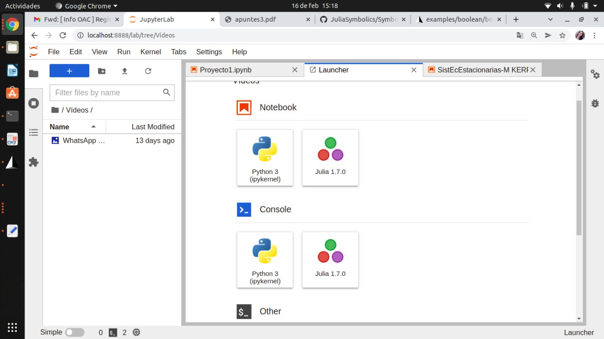
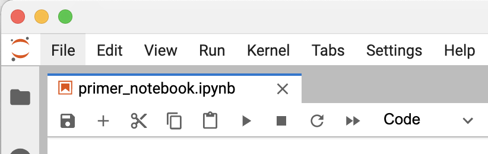
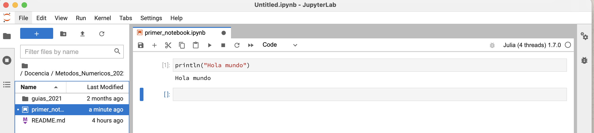
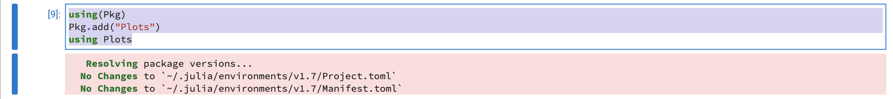
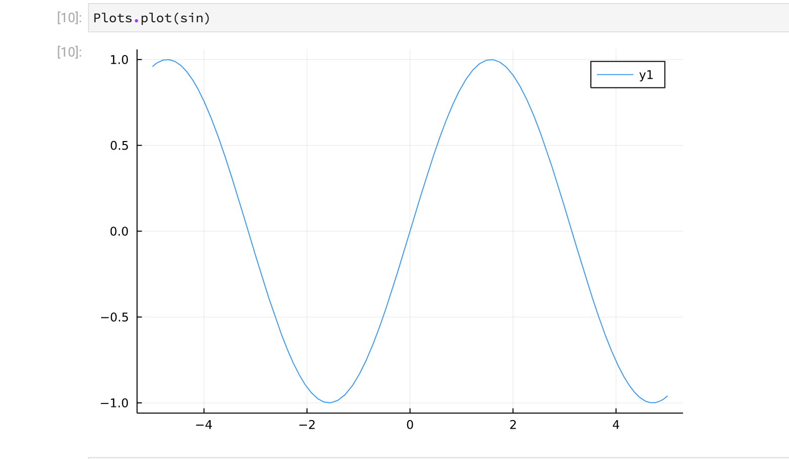

## Cómo instalar Juila o otros accesorios.

Aqui daremos las instrucciones para instalar Julia y otros accesorios.

### Instalando Julia:

La instalación de los binarios de Julia es bastante sencilla:
    
Ir a la [https://julialang.org/downloads/](https://julialang.org/downloads/)
        
Allí elija la instalación de acuerdo al sistema operativo de su computadora. Hoy en día casi todas las computadoras ya son de 64bits, 
pero por las dudas constate si no es de 32 bits, en tal caso use el apropiado.
        
### Siga las instrucciones de instalación de acuerdo a su sistema. 
        
En todos los sistemas, luego de la instalación, la ejecución les dará una ```Terminal``` donde estará ejecutando el REPL. 
Allí ya puede ejecutar comandos de Julia. 

### Trabajando con Julia

Vamos a trabajar con  `IJulia`, es un notebook similar a Jupyter, pero nativo de Julia. Las instrucciones para su instalació
        instalación las pueden encontrar [https://github.com/JuliaLang/IJulia.jl](https://github.com/JuliaLang/IJulia.jl)
   
        
Alternativamente puede usar `Pluto`, es un nuevo tipo de notebook que es muy intersante y tiene varias ventajas sobre los otros. Pero estas ventajas también lo hacen complicado para personas con poca experiencia en la escritura de códigos. Por lo tanto **No lo recomendamos**. 
   De todos modos, las instrucciones para instalarlos están [https://github.com/fonsp/Pluto.jl](https://github.com/fonsp/Pluto.jl)
   
 ## Instalando IJulia
 
 Para ello debe instalar el *paquete* con el código necesario. En la consola REPL presione la tecla `]`, eso le dará acceso al administrador de paquetes. 
 Una ves allí escriba: (alternativamente, desde el REPL simplemente ingrese: `julia> Pkg.add("IJulia")`).
 
    (@v1.7) pkg> add IJulia
    
A continuación (una vez instalado) salga del administrador de paquetes con la tecla `borrar` o `delete` o `backspace` e ingrese:

    julia> using IJulia
    julia> jupyterlab()
    
La primera vez que ejecute este comando tomará un tiempo apreciable hasta que se complete el cargado del sofware y se compile el código. En particular, la primera vez le preguntará si desea instalar **Jupyter**, si no lo tiene ya instalado acceda a ello. En tal caso instalará otro paquete, llamado `Conda.jl`. 
Una vez completado el proceso le debería aparecer una página en su browser donde podrá comenzar a trabajar con su notebook.
Cada vez que comienze a trabajar deberá llamar al REPL e ingresar los dós últimos comandos. Recomendamos ver algún video que les muestre como trabajar. Es la forma más eficiente de aprender lo básico.

### Primer notebook

Para probar que todo el sistema funciona es importante generar una primer notebook donde escribiremos nuestros primeros códigos.

Para ello apretamos el rectángulo azul en la izquierda-arriba que tiene un +, eso abrirá un *launcher* donde verán el logo de Julia

Apretamos el mismo y habremos generado un notebook donde trabajar. En el mismo veremos una región rectangular donde se puede ingresar código, esto se llama una **celda**.
Hay distintos tipos de celda de acuerdo al lenguaje que querramos usar. Cerciorece que la última pestaña que muestra el siguiente gráfico diga **Code**. 

En la primer celda escribimos:

`println("Hola mundo")`

a continuación tecleamos `mayuscula-enter` (`shift-return`) simultáneamente, lo cual ejecutará la primer celda. Si todo anduvo bien debiera imprimirse debajo de la celda
**Hola mundo**. Se abrirá también una segunda donde podremos ingresar más código.



La segunda celda la usaremos para incorporar una librería que usaremos mucho durante el curso, la `Plots.jl`. Para ello ingresaremos,

`using Pkg`

`Pkg.add("Plots")`

`using Plots`



y luego ejecutamos la celda con `mayuscula-enter`. Julia procederá a instalar el paquete **Plots** y nos irá mostrando el avance. Si todo anda bien culminará sin errores y nos abrirá una nueva celda. 

En ella ingresaremos:

`plot(sin)`

Cuando la ejecutemos se producirá un gráfico de la función *seno*. 

#### Ejercicios: ###

Si quiere seguir aprediendo puede hacer algunos ejercicios símples:

1. Visite la página de la librería Plots.jl, [https://docs.juliaplots.org/latest/tutorial/](https://docs.juliaplots.org/latest/tutorial/) y trate de reproducir y entender la lógica de algunos ejemplos. También hay numerosos videos en youtube mostrando como generar gráficos.
2. Además de las celdas de código hay celdas de *markdown* que es una manera de editar y presentar código en forma grafíca de buena calidad. Practique poniendo título e indicaciones del código que escribió entre las celdas de código. Pueden ver un tutorial en [https://markdown.es/sintaxis-markdown/](https://markdown.es/sintaxis-markdown/). Hay muchísimos otros tutoriales y videos. 

Estos dos ejercicios le brindarán una herramienta poderosa que podrá usar en muchas instancias de su carrera.


       
