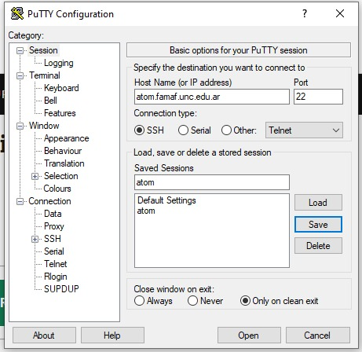
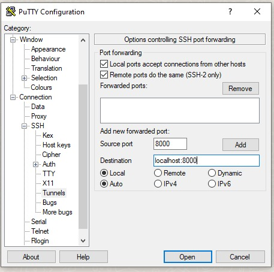
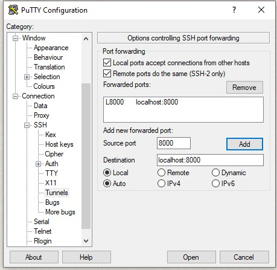
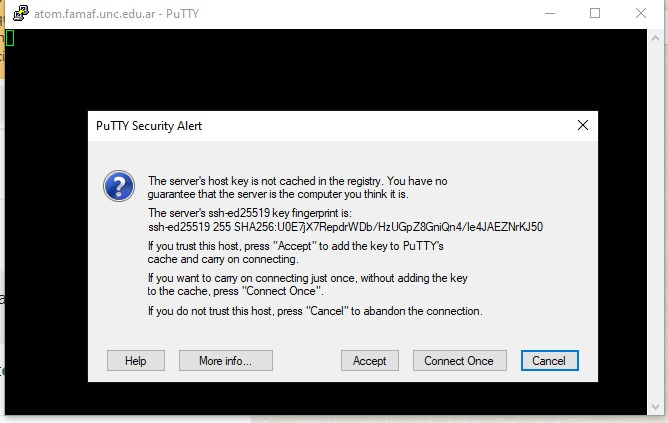

## Instrucciones de como acceder a la instancia de jupyterhub de FaMAF

En la Facultad tenemos instalado (gracias a Nicolás Wolovick) un servidor de jupyterhub. 
Para acceder a el se necesita: 

1. tener una cuenta en la computadora `atom` la cual será provista a todos los alumnos del curso.

2. tener un cliente de ssh (secure shell) en su computador personal. En linux viene por defecto, para Windows se puede usar uno llamado Putty.exe (https://www.putty.org/)
3. Tener un browser.

Una vez que tenga su `usuario` y `contraseña` deberá conectarse a la computadora `atom` de FaMAF por medio de una conexión con tunel (es decir, una conexión por internet a travéz de un puerto de comunicación seguro). 

### Desde Linux
Para establecer dicha conexión, desde una terminal linux, ingrese la siguiente línea de comando 

`mi computadora> ssh -L 8000:localhost:8000 usuario@atom.famaf.unc.edu.ar`

donde debe remplazar `usuario` por su nombre de usuario. Por ejemplo, si su nombre de usuario es `juan.perez`, remplaze `usuario` por `juan.perez`.

Una vez ejecutada la linea de comando, le aparecerá la solicitud de contraseña y una vez que la haya ingresado con éxito en la terminal podrá ingresar comandos en la computadora remota (`atom`), aunque ingresar más comandos no será necesario por el momento. Sigue luego de las instrucciones para Windows.

### Desde Windows

Descargue el cliente de ssh (Putty)(https://www.putty.org/)

Abra la aplicación e ingrese la dirección (nombre) de atom. 
Puede grabar la información para no tener que repetirla en el futuro.

A continuación vaya a ssh -> Tunnel y complete la información como se indica. No olvide los tildes en las casillas arriba. 

Pulse `ADD` para guardar los datos ingresados.

Ahora inicie la conexión. Le aparecerá el siguiente cartel:

Es una noticia de que esa conexión no estaba en sus registros. Pulse `aceptar`.

Si todo anda bien aparecerá una pantalla donde deberá ingresar su usuario.
Luego aparecerá una indicación de que ingrese su clave. *Cuando lo ingrese parecerá que no lo está haciendo* 
eso es por motivos de seguridad. Si es correcto estará en condiciones de ingresar datos en una pantalla de terminal.

### Luego del ingreso: 

#### Primero que nada CAMBIE SU CLAVE! 

Para ello use el comando `passwd` (primero deberá ingresar la clave actual y luego le pedirá dos veces la nueva).

#### Trabajando con jupyterlab

A continuación habra su browser e ingrese la dirección:

`http://localhost:8000`

Le deberá aparecer una pantalla del jupyterlab remoto en esa página. Desde allí podrá trabajar con Julia.

Para terminar la conección, cierre las páginas abiertas via el puerto `8000`, e ingrese la línea de comando `exit` en la terminal. 
El `prompt` de la terminal debería volver al de su computadora.
