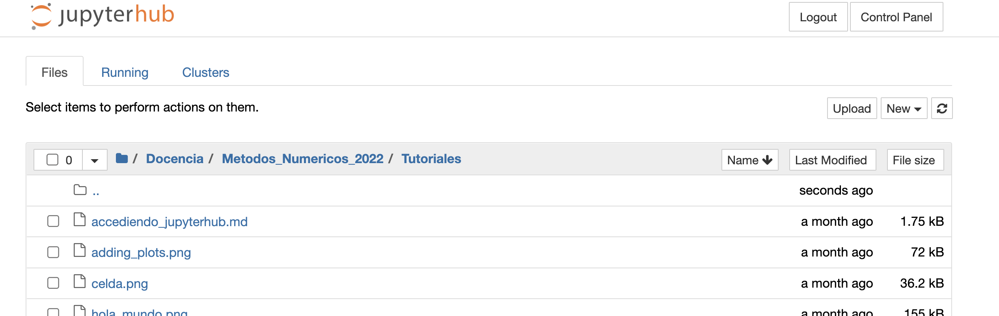

## Como compartir archivos entre capetas locales y remotas

Aquí mostramos como compartir archivos entre carpetas locales y remotas cuando estamos trabajando con un jupyterlab remoto.

### De local a remoto:

1. abra el jupyterlab remoto, posicionese en la carpeta donde quiere enviar el archivo local.
2. acciones el boton `upload` que aparece en el lado derecho-arriba de la pagina del jupyterlab .
3. Aparecerá una ventana de donde podrá elegir el archivo local y de esa forma enviarlo remoto. 

### De remoto a local:

1. abra el jupyterlab remoto y vaya al directorio desde donde desea bajar los archivos. [download1](download_1.png)
2. 
